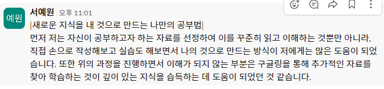

# 📚 TIL - 2024.09.04

## Day 8

### 🔖 오늘 읽은 범위 : 7장. 오류처리

---

### ✨ 책에서 기억하고 싶은 내용
***간단히 말해, 뭔가 잘못될 가능성은 늘 존재한다. 뭔가 잘못되면 바로 잡을 책임은 바로 우리 프로그래머에게 있다.*** (p.130)  <br>
- **오류 코드보다 예외를 사용하라** <br>
    오류가 발생하면 예외를 던지는 편이 낫다. 그러면 호출자 코드가 더 깔끔해진다. 논리와 오류 처리 코드가 뒤섞이지 않으니까.

- **Try-Catch-Finally 문부터 작성하라** (p.132) <br>
    어떤 면에서 try 블록은 트랜잭션과 비슷하다. try 블록에서 무슨 일이 생기든지 catch 블록은 프로그램 상태를 일관성 있게 유지해야 한다. 그러므로 예외가 발생할 코드를 짤 때는 try-catch-finally 문으로 시작하는 편이 낫다.

- **미확인 예외를 사용하라** (p.133) <br>
    확인된 예외는 OCT(Open Closed Principle)를 위반한다. (p.134)
    즉, 하위 단계에서 코드를 변경하면 상위 단계 메서드 선언부를 전부 고쳐야 한다는 말이다.

- **예외에 의미를 제공하라** (p.135) <br>
    예외를 던질 때는 전후 상황을 충분히 덧붙인다. 그러면 오류가 발생한 원인과 위치를 찾기가 쉬워진다.

- **호출자를 고려해 예외 클래스를 정의하라** <br>
    ```
    public class LocalPort{
        private ACMEport innerPort;

        public LocalPort(int portNumber){
            innerPort = new ACMEPort(portNumber);
        }
        public void open(){
            try{
                innerPort.open();
            }catch(DeviceResponseException e){
                throw new PortDeviceFailure(e);
            }catch(...){
                ...
            }
        }
    }
    ```
    여기서 LocalPort 클래스는 단순히 ACMEPort 클래스가 던지는 예외를 잡아 변환하는 감싸기 클래스일 뿐이다. LocalPort 클래스처럼 ACMEPort를 감싸는 클래스는 매우 유용하다. 외부 API를 감싸면 외부 라이브러리와 프로그램 사이에서 의존성이 크게 줄어든다. (p.137) 

- **정상 흐름을 정의하라** (p.138)<br> 
    특수 사례 패턴. 클래스를 만들거나 객체를 조작해 특수 사례를 처리하는 방식이다. 그러면 클라이언트 코드가 예외적인 상황을 처리할 필요가 없어진다. 클래스나 객체가 예외적인 상황을 캡슐화해서 처리하므로.

- **null을 반환하지 마라** <br> 
    메서드에서 null을 반환하고픈 유혹이 든다면 그 대신 예외를 던지거나 특수 사레 객체를 반환한다. (p.139) 

- **null을 전달하지 마라** (p.140)<br> 
    정상적인 인수로 null을 기대하는 API가 아니라면 메서드로 null을 전달하는 코드는 최대한 피한다.

오류처리를 프로그램 논리와 분리하면 독립적인 추론이 가능해지며 코드 유지보수성도 크게 높아진다.

---

### 💭 오늘 읽은 소감은? 떠오르는 생각은?
이 책을 읽을 때마다 이 책이 주의하라고 지적한 점을 과거에 내가 한 것에 대해 많이 반성하게 된다. 하하 😅 과거에 나는 오류 처리를 할 때마다 위에서 말한 것 처럼 하위 단계 코드를 변경할 시에 상위 단계의 코드를 변경해야 하여 코드 수정이 힘들고 더러워 보인 적이 있었다. 이를 어떻게 해결하면 좋을까 고민한 적이 있었는데, 이 책을 통해 때로는 확인된 예외도 유용하나, 일반적인 애플리케이션은 의존성이라는 비용이 이익보다 크다라는 것을 생각하며 코드를 작성해야겠다는 생각이 들었다.

---

### 🔎 궁금하거나, 잘 이해되지 않은 내용
---
### 📣 과제
<details>
    <summary>
        과제2: 나만의 공부법
    </summary>
     
</details>
